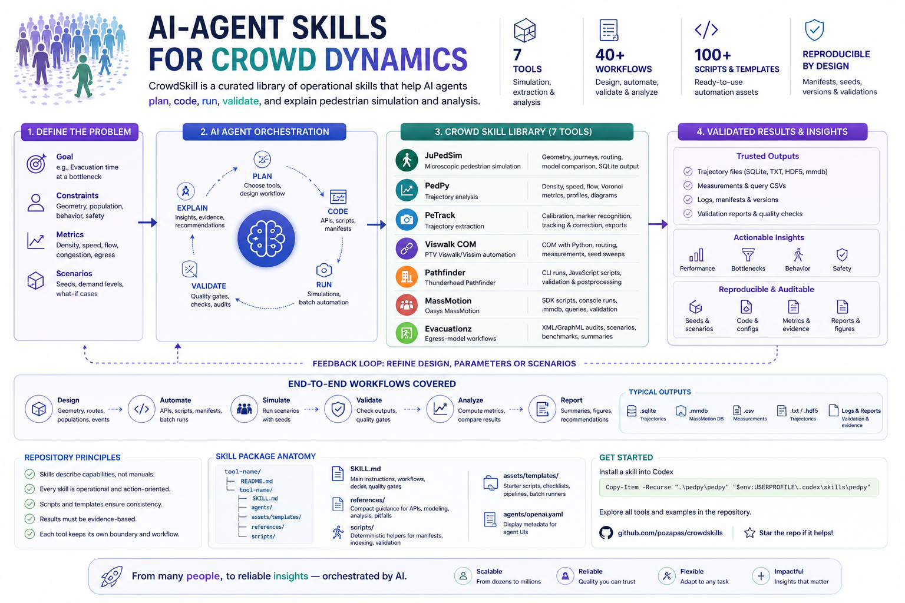

<p align="center">
  
</p>

# CrowdSkill

CrowdSkill is a curated library of AI-agent skills for pedestrian dynamics, crowd simulation, trajectory extraction, and movement-data analysis. Each package turns a simulator or analysis tool into a practical operating layer: what to ask first, which APIs and workflows to use, which pitfalls to avoid, and which scripts or templates can make the work reproducible.

The repository is designed for agents that need to do real engineering work: write code, prepare batch runs, validate outputs, audit assumptions, and explain results without mixing source manuals into the GitHub history.

## Version One At A Glance

_Released May 6, 2026_

<p align="center">
  
</p>

## What Is Inside

| Skill | Focus | Best For |
| --- | --- | --- |
| `jupedsim` | JuPedSim microscopic pedestrian simulation | geometry, journeys, routing, model comparison, SQLite trajectory output, experiment matrices |
| `pedpy` | PedPy trajectory analysis | density, speed, flow, Voronoi metrics, profiles, measurement areas, fundamental diagrams |
| `petrack` | PeTrack trajectory extraction | camera planning, calibration, marker recognition, tracking correction, TXT/HDF5 exports |
| `viswalk-com` | PTV Viswalk/Vissim COM automation | Python `pywin32`, pedestrian demand, routing, measurements, seed sweeps, COM debugging |
| `pathfinder` | Thunderhead Pathfinder workflows | GUI modeling, command-line runs, JavaScript custom scripts, output validation, postprocessing |
| `massmotion` | Oasys MassMotion workflows | Python SDK scripts, script objects, `MassMotionConsole`, `.mmdb`, query CSVs, result validation |
| `evacuationz` | Evacuationz egress-model workflows | XML/GraphML audits, scenario files, benchmark checks, output summaries, study reports |

## Repository Principles

- **Skills describe software capabilities, not copied manuals.** Source manuals stay outside the repo and are ignored by Git.
- **Every skill is operational.** The goal is to help an agent plan, code, run, validate, and interpret a workflow.
- **Scripts are consistency aids.** Manifests, validators, and templates make assumptions visible and repeatable.
- **Results need evidence.** Simulation conclusions should point to output files, metrics, seeds, versions, and validation checks.
- **Each tool keeps its own boundary.** Viswalk uses COM, MassMotion uses its SDK/console, Pathfinder uses console plus JavaScript scripts, JuPedSim uses Python APIs, PeTrack is GUI-centered, and PedPy analyzes trajectories.

## Skill Package Anatomy

Most skills follow the same structure:

```text
tool-name/
|-- README.md
`-- tool-name/
    |-- SKILL.md
    |-- agents/
    |   `-- openai.yaml
    |-- assets/
    |   `-- templates/
    |-- references/
    `-- scripts/
```

| Path | Purpose |
| --- | --- |
| `SKILL.md` | main agent instructions, workflows, decision tables, quality gates |
| `references/` | compact domain guidance for APIs, modeling, analysis, pitfalls, and workflows |
| `scripts/` | deterministic helpers for manifests, indexing, validation, or output checks |
| `assets/templates/` | starter scripts, checklists, analysis pipelines, and batch runners |
| `agents/openai.yaml` | short display metadata for agent UIs |

## Getting Started

### Option 1: npx (all platforms)

Install CrowdSkill with one command:

```bash
npx skills add pozapas/crowdskills --full-depth
```

Keep `--full-depth`; most CrowdSkill packages are nested one folder below the repository root.

Install one specific skill:

```bash
npx skills add pozapas/crowdskills --full-depth --skill viswalk-com
```

Install for a specific tool:

```bash
npx skills add pozapas/crowdskills --full-depth -a codex
npx skills add pozapas/crowdskills --full-depth -a claude-code
npx skills add pozapas/crowdskills --full-depth -a cursor
```

This works for Codex, Claude Code, Cursor, and other tools that support Agent Skills.

### Option 2: local installer

Use this when you want explicit local control over source and destination folders.

```powershell
git clone https://github.com/pozapas/crowdskills.git
Set-Location crowdskills
.\scripts\install-crowdskill.ps1 -All
```

Install one skill:

```powershell
.\scripts\install-crowdskill.ps1 -Skill viswalk-com
```

Install into another project:

```powershell
.\scripts\install-crowdskill.ps1 -Skill viswalk-com -ProjectRoot "D:\path\to\your\project"
```

### Manual source folders

Copy the folder that contains `SKILL.md` into your agent's skills directory:

| Skill | Source folder containing `SKILL.md` |
| --- | --- |
| `jupedsim` | `.\jupedsim\jupedsim` |
| `pedpy` | `.\pedpy\pedpy` |
| `petrack` | `.\petrack\petrack` |
| `viswalk-com` | `.\viswalk-com\viswalk-com` |
| `pathfinder` | `.\pathfinder\pathfinder` |
| `massmotion` | `.\massmotion\massmotion` |
| `evacuationz` | `.\evacuationz` |

Restart your agent after installation if the skill does not appear immediately.

## Example Prompts

```text
Use $jupedsim to create a bottleneck evacuation experiment with a SQLite recording and validation checks.
```

```text
Use $pedpy to compute density, speed, and flow through a measurement line from this trajectory file.
```

```text
Use $viswalk-com to write a Python COM seed sweep that changes pedestrian input volume and exports measurements.
```

```text
Use $massmotion to create a MassMotionConsole batch manifest for three random seeds and validate the mmdb/log/CSV outputs.
```

```text
Use $pathfinder to prepare a command-line run manifest and analyze occupant history outputs.
```

```text
Use $petrack to plan calibration, marker recognition, manual correction, and final TXT export for this video experiment.
```

```text
Use $evacuationz to audit an XML project folder, compare benchmark behavior, and summarize run outputs.
```

## Workflows Covered

### Simulation Design

- Geometry and walkable-space setup
- Route/journey/event design
- Population and demand definitions
- Random seeds and scenario manifests
- Model family and parameter selection
- Sensitivity, calibration, and model comparison

### Automation

- Python scripts for JuPedSim, PedPy, MassMotion SDK, and Viswalk COM
- Command-line run manifests for MassMotion, Pathfinder, and Viswalk-style batches
- Script-object and custom-script templates where the simulator supports them
- Batch result CSVs with one row per run, seed, and scenario

### Validation And Analysis

- SQLite and `.mmdb` checks
- trajectory export validation
- required-column checks for CSV outputs
- query and measurement provenance
- reproducible output folders
- interpretation tied to metrics rather than animations alone

## Development

Validate an individual skill with SkillForge:

```powershell
$env:PYTHONIOENCODING='utf-8'
python "$env:USERPROFILE\.agents\skills\SkillForge\scripts\quick_validate.py" ".\massmotion\massmotion"
python "$env:USERPROFILE\.agents\skills\SkillForge\scripts\validate-skill.py" ".\massmotion\massmotion"
```

Compile Python helpers and templates:

```powershell
python -m py_compile `
  .\jupedsim\jupedsim\scripts\*.py `
  .\petrack\petrack\scripts\*.py `
  .\viswalk-com\viswalk-com\scripts\*.py `
  .\pathfinder\pathfinder\scripts\*.py `
  .\massmotion\massmotion\scripts\*.py
```

Check the worktree before committing:

```powershell
git status --short
```

## Manuals And Source Material

Large vendor manuals and local source documents are intentionally excluded:

```text
Manuals/
```

The skills should summarize stable software capabilities, workflows, pitfalls, and reusable automation patterns. Do not commit proprietary manuals, generated manual indexes, or large local analysis outputs.

## Contributing A New Skill

1. Create `tool-name/tool-name/SKILL.md`.
2. Add concise references for workflows, API surfaces, pitfalls, and validation.
3. Add scripts only when they make repeatable work safer or easier.
4. Add templates for common user tasks.
5. Validate with SkillForge.
6. Keep source manuals and bulky generated outputs out of Git.

## Roadmap

- Add richer bridge templates between simulators and PedPy.
- Add validators for common commercial-simulator CSV exports.
- Add example manifests for paired scenario studies.
- Add more reproducibility metadata helpers.
- Add project-specific templates for stations, stadiums, schools, hospitals, and evacuation studies.
